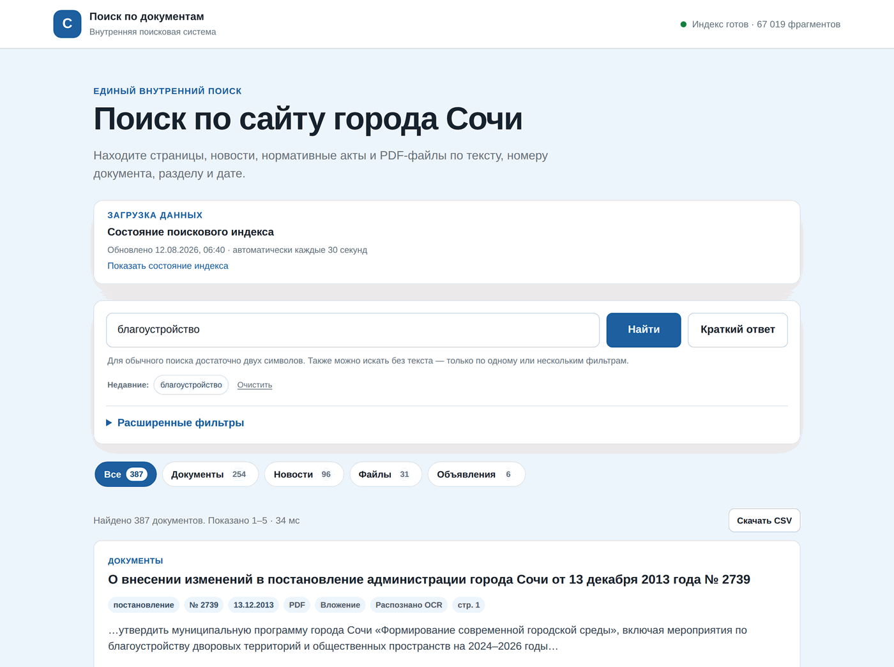
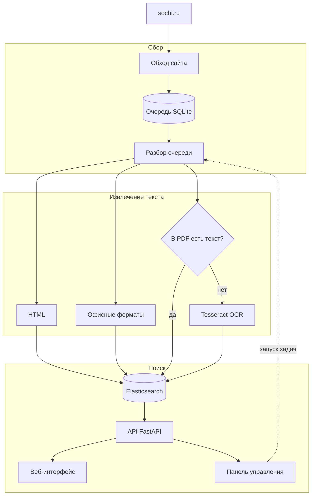
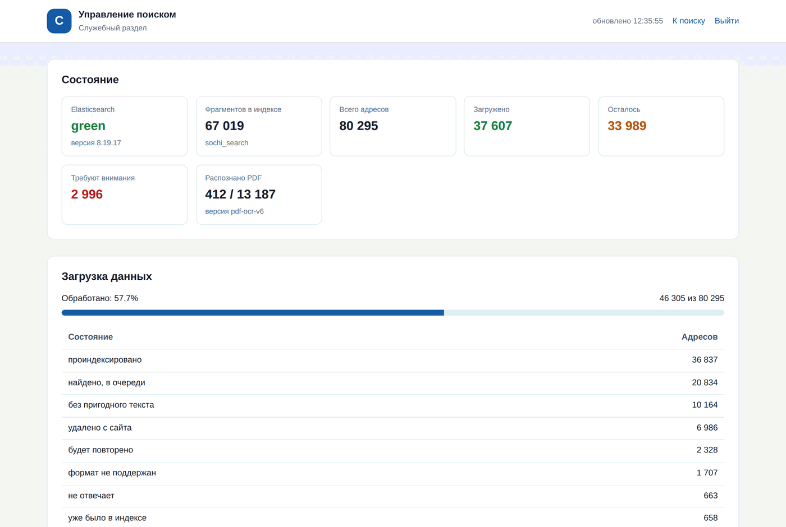
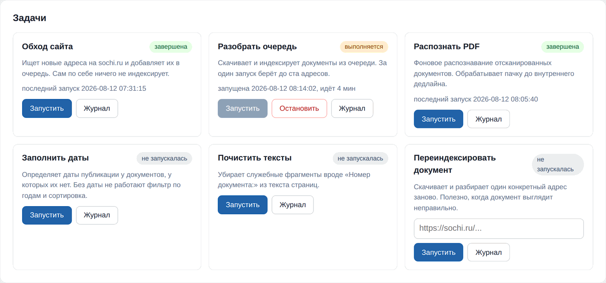

# Поиск по сайту города Сочи

Внутренняя поисковая система по сайту администрации Сочи: обходит
`sochi.ru`, вытаскивает текст из страниц, PDF и офисных файлов,
распознаёт отсканированные документы и складывает всё в Elasticsearch.
Работает во внутренней сети, без выхода наружу.

Около 80 тысяч адресов в очереди, 67 тысяч фрагментов текста в индексе,
13 тысяч PDF — из них большая часть сканы без текстового слоя.



---

## Зачем это нужно

На `sochi.ru` лежит вся нормативная база города: постановления,
распоряжения, решения Городского Собрания, регламенты. Штатный поиск
сайта не находит в них почти ничего, и причин три.

**Документы — это сканы.** Постановление 2013 года выглядит как PDF, но
внутри у него не текст, а фотография бумаги. Для поиска такой файл
пустой. Сотрудник, которому нужно постановление про благоустройство,
либо помнит его номер, либо не найдёт вообще.

**Номера пишутся как попало.** Один и тот же акт встречается как
«№ 512-р», «512-Р», «N 512 – p» — с латинской «p», с разными тире, с
пробелами. Поиск по строке не сводит эти написания вместе.

**Нечем сузить выдачу.** Нет фильтра по годам, по виду документа, по
разделу сайта. На запрос «благоустройство» вываливается всё сразу.

Задача системы — сделать так, чтобы человек нашёл нужный документ по
паре слов из названия или по номеру, а не листал разделы вручную.

---

## Что умеет

| | |
| --- | --- |
| **Форматы** | HTML, PDF (включая сканы), DOCX, XLSX, RTF, ODT, ODS, TXT, CSV |
| **Морфология** | русские окончания: «благоустройству» находится по «благоустройство» |
| **Номера актов** | «512-р», «№ 512 – Р» и «N 512p» — один и тот же документ |
| **Фильтры** | год, диапазон дат, вид документа, раздел сайта, тип файла |
| **Синтаксис** | `«состав семьи»` — точная фраза, `-конкурс` — исключить слово |
| **Рубрики** | вкладки со счётчиками: документы, новости, файлы, объявления |
| **Краткий ответ** | сводка по верхним результатам со ссылками на источники |
| **Выгрузка** | результаты в CSV |
| **Управление** | состояние и запуск задач из браузера, без доступа к серверу |


Карточка результата показывает, откуда взялся текст: вид и номер
документа, дату, формат, страницу и пометку «Распознано OCR», если
текста в файле не было и его пришлось прочитать с картинки.

---

## Как это устроено



Пять рабочих процессов, каждый со своим ритмом:

| Процесс | Что делает | Как часто |
| --- | --- | --- |
| `discovery` | ищет на сайте новые адреса | раз в час |
| `worker` | скачивает и разбирает документы из очереди | раз в 2 минуты |
| `ocr-1`, `ocr-2` | распознают сканы в два слота | непрерывно |
| `publication-date` | восстанавливает даты публикации | раз в 5 минут |

Очередь в SQLite — источник истины. В ней у каждого адреса есть
состояние (`discovered`, `indexed`, `retry`, `gone`, …), хеш содержимого,
число попыток и аренда: воркер забирает адрес на время, и если процесс
умрёт, адрес вернётся в очередь сам. Благодаря этому обход можно
останавливать и продолжать когда угодно, а повторный проход не
перекачивает то, что не изменилось.

---

## Инженерные решения

Здесь интереснее всего, поэтому подробнее — с цифрами. Все замеры
сделаны на рабочем сервере (4 ядра Xeon E5-2670, 8 ГБ, машина общая — на
ней же PHP-FPM, MariaDB и Node) на настоящих файлах с `sochi.ru`.

### Распознавание: 157 секунд на страницу → 9,5

Исходная схема брала PDF-страницу и отдавала её Tesseract как есть.
Результат на реальном постановлении:

| | Время | Символов | Доля кириллицы |
| --- | ---: | ---: | ---: |
| было | 157,45 с | 12535 | 0,402 |
| стало | **9,54 с** | 3027 | **1,000** |

Дело не в скорости. Вот что выдавала старая схема:

```
[== НВННННЕННе == | 2 | ЗЕЕ а & 28 = = пою 589 ь Зое A 5 в № S SBE ESE
```

А вот новая:

```
АДМИНИСТРАЦИЯ ГОРОДА СОЧИ ПОСТАНОВЛЕНИЕ … город Сочи
О внесении изменений в постановление администрации города Сочи
от 13 декабря 2013 года № 2739 «Об утверждении муниципальной пр…
```

Старый вывод — латинско-кириллическая каша. Проверка качества текста
справедливо её отклоняла, документ уходил в `skipped_empty` и в поиск не
попадал. Таких записей в очереди было **10157 — 17 % корпуса**. Это не
пустые PDF, это документы, которые система не смогла прочитать.

Четыре причины и четыре решения:

**Порог яркости подбирался по всему листу сразу.** Tesseract использует
метод Оцу — один порог на изображение. На выцветшей ксерокопии с тёмным
краем от сканера это даёт либо чёрное пятно, либо белый лист. Заменено
на локальную бинаризацию Сауволы: порог считается по окну вокруг каждого
пикселя, поэтому неравномерная засветка перестаёт мешать. Реализация
через интегральные изображения и статистику на уменьшенной копии,
иначе на 8 мегапикселях это само по себе занимало бы секунды.

**Анализ разметки взрывался на мусоре.** Точки тонера и шум сканера
Tesseract принимает за символы и строит из них строки. Убираются медианным
фильтром 3×3 перед распознаванием.

**Перекос страницы.** Скан почти всегда лежит под углом в доли градуса,
и строки «плывут». Угол оценивается по резкости профиля проекции:
изображение поворачивается пробными углами, и выбирается тот, где сумма
по строкам даёт самые контрастные пики. Важная деталь: бинаризация
делается **до** оценки угла, иначе тень от края листа перевешивает сам
текст.

**Лишний проход по инверсии.** При низкой уверенности Tesseract
повторяет распознавание на инвертированном изображении. Страница уже
бинаризована и заведомо «тёмное на светлом», так что второй проход
бесполезен. `tessedit_do_invert=0` даёт **−29 % времени при побайтово
совпадающем тексте**.

Два измерения, которые опровергли ожидания:

*Понижение разрешения не ускоряет.* Площадь растра вдвое больше — время
на 8 % больше, текста на 0,7 % больше. **Время Tesseract определяется
числом текстовых строк, а не числом пикселей.** Рендер в родном
разрешении скана всё равно выгоден: вдвое меньше памяти.

*Потоки хуже слотов.* Два потока ускоряют отдельную страницу на 29 %,
но по общей пропускной способности проигрывают:

| Схема | Ядер | Страниц в секунду |
| --- | ---: | ---: |
| 1 слот × 2 потока | 2 | 0,165 |
| **2 слота × 1 поток** | 2 | **0,233** |

Принято `OMP_THREAD_LIMIT=1`, параллелизм задаётся числом контейнеров.

### Чем измерить «распозналось плохо»

Оценка качества текста отличает осмысленный текст от глифовой каши. Но
страница, распознанная на 50 %, — это осмысленный русский текст, просто
неправильный. Оценка ставит ей сто баллов из ста и пропускает в индекс.

Собственная уверенность Tesseract такую страницу отличает:

| Страница | Точность | Уверенность | Балл оценки |
| --- | ---: | ---: | ---: |
| Современный скан | 99,4 % | 95,8 | 100 |
| Архивная копия | 98,4 % | 90,2 | 100 |
| Выцветшая копия | 49,7 % | **23,7** | **100** |
| Повёрнутая на 90° | 15,9 % | 19,9 | 81 |

Разрыв между 24 и 90 достаточно широк, чтобы поставить порог и не задеть
нормальные страницы. И достаётся уверенность бесплатно: `tesseract page
out txt tsv` — это один разбор страницы и два вида выдачи.

Поле `ocr_confidence` было объявлено в схеме индекса с самого начала и
никогда не заполнялось.

### Вторая попытка вместо потерянной страницы

Раз есть признак, по которому видно, что страница прочитана плохо, на
ней можно попробовать ещё раз. Порядок: обычная бинаризация, мягкая,
затем повороты 90°, 270°, 180°.

| Страница | Одна попытка | С повторами | Попыток |
| --- | ---: | ---: | ---: |
| Современный скан | 98,9 % | 98,9 % | 1 |
| Архивная ксерокопия | 98,0 % | 98,0 % | 1 |
| Выцветшая копия | 47,3 % | **55,5 %** | 3 |
| Повёрнутая на 90° | 16,9 % | **98,3 %** | 2 |

Нормальные страницы не дорожают: повтор запускается только когда
Tesseract сам сообщил о низкой уверенности.

Повёрнутый лист — не экзотика: альбомный скан А4 попадает в архив так
же, как книжный, и терялся целиком. Признак ориентации по проекциям
изображения проверялся и отвергнут: на зашумлённой странице дисперсии
профилей по строкам и по столбцам различаются на единицы процентов, и на
выцветшей копии признак уверенно ошибается. Спросить сам Tesseract и
сравнить уверенность — надёжнее.

### Английская модель портит русский текст

`rus+eng` замедляет распознавание — это было известно. Оказалось, что
дело не в скорости. Когда Tesseract не уверен в букве, наличие
английской модели разрешает ему выбрать латинский глиф:

| Страница | Язык | Точность | Латинских «слов» |
| --- | --- | ---: | ---: |
| Выцветшая копия | `rus+eng` | 32,6 % | **155 из 261** |
| Выцветшая копия | **`rus`** | **49,7 %** | **0** |

Это и есть та самая каша, из-за которой документ уходил в
`skipped_empty`. Номер акта при `rus+eng` пришёл как «512-p» с латинской
«p»: глазами не отличить, для поиска — другой номер.

### Перенос по слогам ломает поиск

В вёрстке правовых актов строка выравнивается по ширине, поэтому слова
рвутся дефисом: «благоустрой-» на одной строке, «ство» на следующей.
После склейки строк в абзац остаётся «благоустрой- ство» — два токена,
и ни один не найдётся по запросу «благоустройство».

На постановлении в тридцать строк таких разрывов пять-семь, и все они
приходятся на содержательные слова: короткие предлоги не переносят.
Склейка делается до схлопывания пробелов — позже перенос уже не отличить
от настоящего дефиса в «город-курорт».

Касается это не только сканов: у PDF с готовым текстовым слоем переносы
ровно те же.

### Охват вместо глубины

Распознать весь корпус целиком — недели. Но заголовок, номер и дата,
то есть всё, по чему документ ищут, лежат на первых страницах. Первый
проход читает по две страницы каждого скана: **26 часов вместо недель**,
и после них весь корпус становится находимым. Остальные страницы
дочитываются фоном и на доступность поиска уже не влияют.

### Схема индекса

Индекс перестроен под задачу, а не собран из значений по умолчанию.

**Свои анализаторы.** Русский стеммер, `ё` приводится к `е` на уровне
char_filter, отдельное подполе `.exact` без стемминга — для точных
совпадений, которые должны стоять выше приблизительных.

**Номера документов — отдельное поле.** `whitespace` + `word_delimiter`
с `catenate_all`: «512-р» индексируется и как «512-р», и как «512р», и
как «512» + «р». Плюс нормализация запроса — латинские близнецы
кириллических букв (`p` → `р`, `c` → `с`), разные виды тире, «№» и «N»
приводятся к одному виду.

**Нормализаций было две, и они расходились.** Запрос нормализовал номер
в Python, индекс — нормализатором в схеме, и делали они разное:

| Как записано | Терм в индексе | Терм запроса | Совпадает |
| --- | --- | --- | --- |
| `512-р` | `512-р` | `512-р` | да |
| `№ 512-р` | `№  512-р` | `512-р` | **нет** |
| `512 - р` | `512 - р` | `512-р` | **нет** |
| `512-p` | `512-p` | `512-р` | **нет** |
| `N 512-p` | `n 512-p` | `512-р` | **нет** |

Из семи реалистичных написаний точное совпадение с весом 40 срабатывало
на двух. Держалось всё на подполе `.text` с весом 0,6 — то есть работало,
но заметно хуже, чем задумано, и молча.

Теперь нормализация одна на весь проект: её вызывает и запрос, и
обходчик, складывая результат в поле `document_number_normalized`.
Цепочка `char_filter` в схеме приводит к тому же виду — это проверяется
тестом, который воспроизводит правила `mapping`-фильтра и сверяет
результат с функцией запроса. Старые документы канонизируются самим
нормализатором при `_reindex`, поэтому второй реализации, способной
разойтись с первой, не появляется.

**Граф токенов на индексной стороне.** `word_delimiter_graph` порождает
граф, а обратный индекс графов не хранит: без `flatten_graph` часть
вариантов записывается и теряется молча. На стороне запроса граф,
наоборот, нужен — там он разворачивается в клаузы. Стало два анализатора:
индексный с выпрямлением и поисковый без.

**Рубрика вычисляется при индексации.** Раньше фильтр по разделу
строился как набор `prefix` по URL — по пять хостов на каждый путь, и
это повторялось для каждой корзины фасета. Стало одно поле `keyword`.

**Одна дата сортировки.** Было три поля (`document_date`,
`published_at`, `sort_date`), и фильтр перебирал их через `should`:
акт 2019 года с датой публикации 2024 находился по обоим годам. Теперь
`sort_date` заполняется при индексации, фильтр — один диапазон.

**Порог совпадения ступенькой.** `minimum_should_match: 75%`
округляется вниз, и на двухсловном запросе вырождается в одно слово.
Форма `3<75%` — до трёх слов нужны все, дальше три четверти:

| Запрос | Было | Стало |
| --- | ---: | ---: |
| `512-р` | 2460 | **4** |
| `постановление о благоустройстве` | 10277 | **387** |

**Кавычки и минус ничего не делали.** Обе конструкции уходили в
`multi_match` как обычные символы, токенизатор их выбрасывал, и «состав
семьи» в кавычках искалось ровно так же, как без кавычек. Сотрудник,
который взял фразу в кавычки, хотел сузить выдачу, а получал ту же
самую — и не имел способа об этом узнать. Теперь цитата обязательна и
проверяется по точной форме и по лемме, минус-слово уходит в `must_not`.
Минус распознаётся только после пробела, поэтому «512-р» и
«город-курорт» остаются целыми словами.

Полноценный синтаксис с `AND`, `OR` и скобками сознательно не делался:
его нужно объяснять, а `query_string` с пользовательским вводом ещё и
падает на несбалансированной скобке.

Переход на новую схему сделан через `_reindex` внутри кластера с
переключением alias: 57 636 документов, ноль отказов, поиск не
останавливался.

### Ошибки, которые нашлись по дороге

Это, пожалуй, самая полезная часть. Несколько находок и то, чем они
обернулись бы:

- **Модуль написан и не подключён.** Новый построитель запросов был
  покрыт тестами, но сервис продолжал использовать старый. То же
  случилось с движком OCR. Ни один модульный тест этого не видел: каждый
  проверял свой модуль, а не то, что конвейер его использует. Появился
  `tests/test_wiring.py` — он проверяет связки, а не единицы.
- **Ограничение охвата считалось по номеру страницы, а не по числу
  попыток.** На документах со смешанным содержимым (текстовая обложка +
  сканированное приложение) не распознавалось вообще ничего. Симптом:
  «PDF OCR страниц: 0» при полной очереди.
- **Расписание опиралось на общий `.target`.** Он остаётся активным
  после первого запуска, поэтому повторные срабатывания таймера ничего
  не делали. Слоты отработали ровно один раз.
- **Аннотации, которые вычисляются во время выполнения.** `str | None` и
  `dict[str, Any]` в обработчиках FastAPI: `from __future__ import
  annotations` их не спасает, потому что FastAPI и pydantic передают
  строку аннотации в `eval`. На сервере с Python 3.8 модуль не
  импортировался бы, а вместе с ним не поднялся бы весь API.
- **Elasticsearch и приложение в разных сетях Docker.** Имя из `ES_URL`
  не разрешалось, и развёртывание с нуля упиралось в ожидание кластера,
  который запущен и здоров.
- **Две реализации одной нормализации.** Номер акта приводился к
  каноническому виду и в запросе, и в схеме индекса — по-разному.
  Внешне всё работало: находилось через запасное подполе, только хуже.
  Тест теперь воспроизводит правила `mapping`-фильтра из схемы и сверяет
  их с функцией запроса.
- **Тесты, разошедшиеся с кодом.** Два не проходили: один ждал
  `DownloadTooLargeError` там, где код давно кидает
  `DocumentTooLargeError`, второй сверялся со строкой `pdf-ocr-v5`, когда
  в коде уже стоял `pdf-ocr-v6`. Второй переписан на сверку с самой
  константой — так он не устареет молча.
- **Пакет, который выглядит мёртвым, но работает.** Первая версия
  сервиса, `app/`, десять модулей: её не собирал Dockerfile, на неё не
  ссылались ни тесты, ни README, и в `systemd/` её юнита нет. По этим
  признакам она мёртвая — и была удалена как мёртвая. А на сервере она
  работала: юнит `sochi-search.service` заведён на машине руками и
  поднимал её на отдельном порту, отдавая выдачу из отдельного индекса,
  который не обновлялся с самого переезда на `app_v2`. Сотрудники,
  попадавшие на этот порт, полтора года искали по старым данным.

  Служба остановлена, пакет удалён — но уже осознанно. Проверка на
  появление пакета вне списка осталась: раньше проверка связок перебирала
  три имени, и четвёртый пакет проходил мимо неё целиком.

  Вывод неприятный и полезный: «в репозитории ни одной ссылки» не значит
  «не используется». Юнит, заведённый на сервере руками, из репозитория
  не виден никак.
- **Виды выдачи Tesseract задавались именами файлов конфигурации.**
  `txt` и `tsv` — это файлы в `$TESSDATA_PREFIX/configs/`, а в
  `ocr/tessdata` лежат только языковые модели. На стенде замеры шли с
  системной tessdata, где `configs/` есть, и всё работало. На сервере
  Tesseract писал «Can't open tsv», TSV не создавался, уверенность
  выходила нулевой — а ноль меньше любого порога, поэтому лестница
  повторов шла на **каждой** странице: пять попыток вместо одной,
  26 секунд вместо пяти. И при равных нулях побеждала первая попытка,
  так что повёрнутая страница не восстанавливалась.

  Виды выдачи теперь задаются переменными через `-c`, которым `configs/`
  не нужен. Плюс отдельная защита: нулевая уверенность при непустом
  тексте означает «не измерили», а не «плохо распознали», и лестницу не
  запускает.
- **`mode=` у `Image.fromarray`.** Параметр объявлен устаревшим и
  исчезает в Pillow 13, выпуск которой назначен на 15 октября 2026 года.
  Тип массива и так определяет режим, так что убрать его — правка на
  три строки; не убрать — отказ подготовки изображения после
  очередного `pip install`.

На каждую написан тест. Не «на всякий случай», а именно на тот класс
ошибки, который однажды прошёл мимо: разбор всего кода синтаксисом
Python 3.8, объявленность зависимостей, общая сеть в compose,
подключённость модулей, согласие двух реализаций одной нормализации.

---

## Панель управления

Раньше всё делалось командами на сервере. Теперь состояние и запуск
задач — из браузера.



Видно состояние кластера, размер индекса, разбивку очереди по
состояниям и форматам, прогресс распознавания и состояние служб systemd.



Задачи запускаются кнопками, с живым журналом выполнения. Панель
намеренно не управляет службами: для этого нужен root, а задачи
запускаются напрямую и берут те же файлы блокировок, что и расписание, —
двух одновременных обходов не случится.

Раздел закрыт формой входа: логин, пароль, сессия на 12 часов. Пароль
хранится хешем; смена пароля автоматически завершает все открытые
сеансы. Сам поиск открыт всем — им пользуются сотрудники, управлением
единицы.

---

## Стек

| | |
| --- | --- |
| **Язык** | Python 3.8+ (в контейнере 3.12) |
| **Поиск** | Elasticsearch 8.19 |
| **API** | FastAPI, uvicorn |
| **Распознавание** | Tesseract 4.1+, PyMuPDF, NumPy, Pillow |
| **Очередь** | SQLite с арендой записей |
| **Интерфейс** | обычный JavaScript, без фреймворков и сборки |
| **Запуск** | Docker Compose или systemd |
| **Тесты** | стандартный `unittest`, без зависимостей |

Размер: около 24 тысяч строк Python, 8 тысяч строк тестов и 5 тысяч
строк интерфейса. Тестов 295.

Внешних зависимостей у интерфейса нет вообще — ни React, ни сборщика.
Для служебной системы на десяток-другой сотрудников это осознанный
выбор: нечему протухать, нечего пересобирать, а поддерживать сможет
любой, кто знает JavaScript.

---

## Развернуть у себя

Нужна машина с Linux, Docker и 20 ГБ свободного диска. Двух ядер и 6 ГБ
памяти хватит, комфортно — четыре ядра и 8 ГБ.

```bash
git clone <адрес репозитория> sochi-search
cd sochi-search

bash deploy.sh          # создаст .env и остановится
nano .env               # заполнить три значения
bash deploy.sh          # соберёт образ и всё поднимет
```

Заполнить нужно ровно три строки:

- `ADMIN_USERNAME` — логин раздела управления;
- `ADMIN_PASSWORD_SHA256` — отпечаток пароля:

  ```bash
  python3 -c "import hashlib,getpass;print(hashlib.sha256(getpass.getpass().encode()).hexdigest())"
  ```

- `API_BIND` — адрес, на котором слушать. Именно он закрывает поиск от
  интернета: порт открывается только на этом адресе.

Через 5–10 минут поиск будет на `http://<адрес>:18084/ui`, панель — на
`/admin`. Индекс при этом пустой: нажмите в панели «Обход сайта», затем
«Разобрать очередь».

Подробно, с переносом данных со старой машины и разбором частых
ошибок — **[docs/DEPLOY.md](docs/DEPLOY.md)**.

Одна системная настройка, без которой Elasticsearch не стартует:

```bash
sysctl -w vm.max_map_count=262144
```

### Проверить код

```bash
python -m unittest discover -s tests -p "test_*.py"
```

295 тестов, из них 5 пропускаются: все пять описывают снятый движок
распознавания через `page.get_textpage_ocr` и оставлены как описание
прежнего поведения. Пропуски объявлены явно и видны в выводе.

Качество распознавания тестами не проверяется — оно измеряется:

```bash
python -m ops.ocr_benchmark
```

Инструмент синтезирует страницы из известного текста, портит их так, как
их портит копирование и сканирование, и считает CER и WER. Нужен
установленный `tesseract`; результаты — в
[docs/OCR_BENCHMARK.md](docs/OCR_BENCHMARK.md).

Или в контейнере, тем же образом, что и в работе:

```bash
docker compose -f docker-compose.yml -f docker-compose.app.yml run --rm api tests
```

---

## Структура проекта

```
app_v2/          поиск: API, разбор запроса, раздел управления, интерфейс
crawler_v2/      обход сайта, извлечение текста, распознавание сканов
elasticsearch/   схема индекса и анализаторы
ops/             перенос индекса, резервные копии, проверки кластера
docker/          точка входа образа: одна роль на контейнер
systemd/         юниты для установки без Docker
tests/           295 тестов на стандартном unittest
docs/            развёртывание, замеры, разбор проекта
```

Заметные файлы:

| Файл | Что в нём |
| --- | --- |
| `crawler_v2/pdf_ocr_image.py` | бинаризация Сауволы, устранение перекоса, чистка шума |
| `crawler_v2/pdf_ocr_engine.py` | вызов Tesseract, уверенность из TSV, лестница повторов |
| `crawler_v2/text_repair.py` | склейка переносов, латинские двойники, номера актов |
| `app_v2/search_query.py` | сборка запроса, кавычки и минус-слова |
| `elasticsearch/sochi_docs_v4.json` | анализаторы, поля, подполя `.exact` |
| `ops/reindex.py` | перенос индекса и переключение alias без простоя |
| `ops/ocr_benchmark.py` | замер распознавания на страницах с известным эталоном |
| `tests/test_wiring.py` | проверка связок: модуль можно написать и не подключить |
| `tests/test_document_number.py` | схема и запрос обязаны нормализовать номер одинаково |

---

## Документация

| Файл | О чём |
| --- | --- |
| [docs/DEPLOY.md](docs/DEPLOY.md) | развёртывание и переезд на другую машину |
| [docs/MIGRATION_V4.md](docs/MIGRATION_V4.md) | переход на схему v4 и распознавание v7, с откатом |
| [docs/OCR_BENCHMARK.md](docs/OCR_BENCHMARK.md) | замеры распознавания на воспроизводимых страницах |
| [docs/SERVER_MEASUREMENTS.md](docs/SERVER_MEASUREMENTS.md) | замеры распознавания на рабочем сервере |
| [docs/REVIEW_REPORT.md](docs/REVIEW_REPORT.md) | разбор проекта: что было не так и почему |
| [docs/CHANGES_RC4.md](docs/CHANGES_RC4.md) | что изменилось и по какой причине |
| [docs/AUDIT_ROUND_2.md](docs/AUDIT_ROUND_2.md) | второй круг проверки кода |
| [docs/MIGRATION.md](docs/MIGRATION.md) | короткая выжимка про перенос данных |
| [OPERATIONS.md](OPERATIONS.md) | эксплуатация без Docker, через systemd |

---

## Состояние и планы

Система работает в продуктиве. Корпус проиндексирован больше чем
наполовину, распознавание идёт фоном.

Переход на схему индекса v4 и распознавание v7 описан отдельно, вместе с
откатом каждого шага: **[docs/MIGRATION_V4.md](docs/MIGRATION_V4.md)**.

Что осталось и что планируется:

- **Проверить лестницу повторов на настоящем корпусе.** Замеры сделаны
  на синтетических страницах: они воспроизводят механизмы порчи, но не
  заменяют реальные сканы. На сервере нужно посмотреть долю страниц с
  уверенностью ниже порога — она показывает, во что обойдётся вторая
  попытка по времени, — и долю страниц, где победил поворот: это оценка
  того, сколько документов терялось целиком.
- **Второй проход по уверенности.** Поле `ocr_confidence` теперь
  заполняется, так что документы можно отбирать на перечитывание не по
  версии движка, а по тому, насколько плохо они прочитаны. Отбор пока
  не автоматизирован.
- **Файлы больше 150 МБ** не скачиваются: один такой занимает воркер на
  десятки минут. В очереди найден PDF на 262 МБ. Помечаются статусом
  `skipped_too_large` и обрабатываются вручную по одному.

  Статус ставился обходчиком и показывался панелью, но `mark_skipped` в
  базе его не принимала — падала с `ValueError`. Очередь разбирается по
  порядку, поэтому воркер падал на одном и том же документе каждый
  запуск: на рабочем сервере это остановило индексацию целиком, упёршись
  в PDF на 237 МБ. Функция была написана в трёх файлах, и ровно в одном
  её забыли. Проверка теперь сверяет не список, а согласие списков: все
  статусы, которые обходчик передаёт, обязаны приниматься базой.
- **Заголовки с оттиском печати** распознаются неверно на любом
  разрешении — это штамп, а не текст. Реквизиты берутся из тела
  документа и из родительской HTML-карточки.
- **Бот в мессенджере Max.** Поиск уже отдаёт готовый JSON по
  `GET /search?q=…`, так что бот встаёт соседним контейнером в ту же
  сеть и ходит на `http://api:8000/search`. Менять в поиске ничего не
  придётся.
- **Семантический поиск.** Сейчас поиск лексический: находит по словам
  запроса с учётом морфологии. Семантический искал бы по смыслу — тогда
  «где взять справку о составе семьи» нашло бы документ, в котором нет
  ни одного из этих слов. Нужна машина помощнее, поле `dense_vector` в
  схеме и гибридный запрос. Текст уже нарезан фрагментами по 3500
  символов — ровно тот размер, с которым работают модели, резать заново
  не придётся.

---

## Лицензия и происхождение

Внутренний проект для администрации города Сочи. Код выложен как
портфолио; в репозитории нет ни настроек рабочего контура, ни паролей,
ни данных — только код, схема индекса, языковые модели распознавания и
документация.
