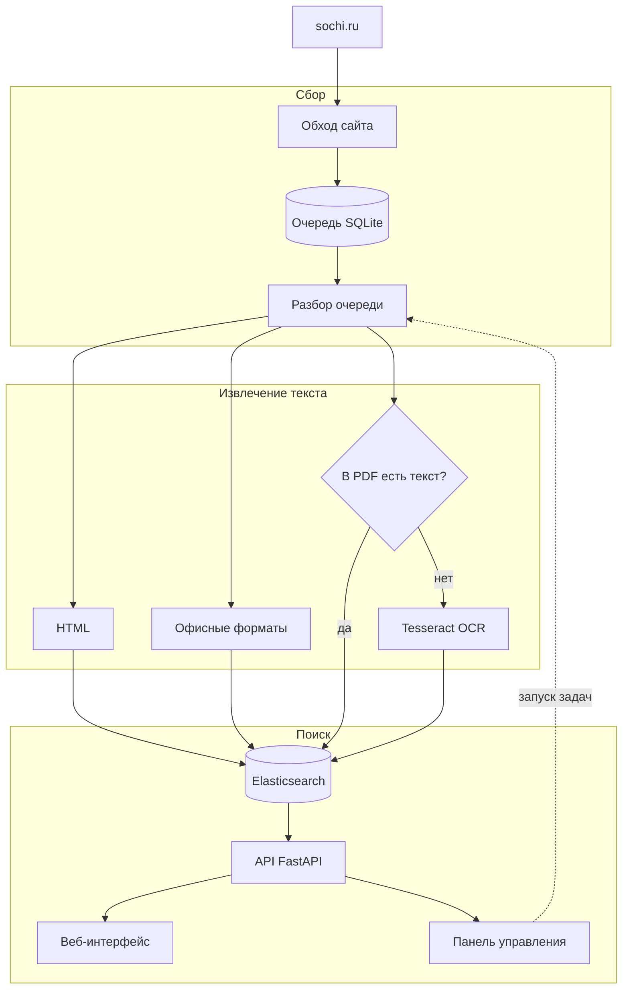

# Поиск по сайту города Сочи

Внутренняя поисковая система по сайту администрации Сочи: обходит
`sochi.ru`, вытаскивает текст из страниц, PDF и офисных файлов,
распознаёт отсканированные документы и складывает всё в Elasticsearch.
Работает во внутренней сети, без выхода наружу.

Около 80 тысяч адресов в очереди, 67 тысяч фрагментов текста в индексе,
13 тысяч PDF — из них большая часть сканы без текстового слоя.


---

## Зачем это нужно

На `sochi.ru` лежит вся нормативная база города: постановления,
распоряжения, решения Городского Собрания, регламенты. Штатный поиск
сайта не находит в них почти ничего, и причин три.

**Документы — это сканы.** Постановление 2013 года выглядит как PDF, но
внутри у него не текст, а фотография бумаги. Для поиска такой файл
пустой. Сотрудник, которому нужно постановление про благоустройство,
либо помнит его номер, либо не найдёт вообще.

**Номера пишутся как попало.** Один и тот же акт встречается как
«№ 512-р», «512-Р», «N 512 – p» — с латинской «p», с разными тире, с
пробелами. Поиск по строке не сводит эти написания вместе.

**Нечем сузить выдачу.** Нет фильтра по годам, по виду документа, по
разделу сайта. На запрос «благоустройство» вываливается всё сразу.

Задача системы — сделать так, чтобы человек нашёл нужный документ по
паре слов из названия или по номеру, а не листал разделы вручную.

---

## Что умеет

| | |
| --- | --- |
| **Форматы** | HTML, PDF (включая сканы), DOCX, XLSX, RTF, ODT, ODS, TXT, CSV |
| **Морфология** | русские окончания: «благоустройству» находится по «благоустройство» |
| **Номера актов** | «512-р», «№ 512 – Р» и «N 512p» — один и тот же документ |
| **Фильтры** | год, диапазон дат, вид документа, раздел сайта, тип файла |
| **Рубрики** | вкладки со счётчиками: документы, новости, файлы, объявления |
| **Краткий ответ** | сводка по верхним результатам со ссылками на источники |
| **Выгрузка** | результаты в CSV |
| **Управление** | состояние и запуск задач из браузера, без доступа к серверу |


Карточка результата показывает, откуда взялся текст: вид и номер
документа, дату, формат, страницу и пометку «Распознано OCR», если
текста в файле не было и его пришлось прочитать с картинки.

---

## Как это устроено



Пять рабочих процессов, каждый со своим ритмом:

| Процесс | Что делает | Как часто |
| --- | --- | --- |
| `discovery` | ищет на сайте новые адреса | раз в час |
| `worker` | скачивает и разбирает документы из очереди | раз в 2 минуты |
| `ocr-1`, `ocr-2` | распознают сканы в два слота | непрерывно |
| `publication-date` | восстанавливает даты публикации | раз в 5 минут |
| `content-cleanup` | убирает служебные фрагменты из текста | раз в 10 минут |

Очередь в SQLite — источник истины. В ней у каждого адреса есть
состояние (`discovered`, `indexed`, `retry`, `gone`, …), хеш содержимого,
число попыток и аренда: воркер забирает адрес на время, и если процесс
умрёт, адрес вернётся в очередь сам. Благодаря этому обход можно
останавливать и продолжать когда угодно, а повторный проход не
перекачивает то, что не изменилось.

---

## Инженерные решения

Здесь интереснее всего, поэтому подробнее — с цифрами. Все замеры
сделаны на рабочем сервере (4 ядра Xeon E5-2670, 8 ГБ, машина общая — на
ней же PHP-FPM, MariaDB и Node) на настоящих файлах с `sochi.ru`.

### Распознавание: 157 секунд на страницу → 9,5

Исходная схема брала PDF-страницу и отдавала её Tesseract как есть.
Результат на реальном постановлении:

| | Время | Символов | Доля кириллицы |
| --- | ---: | ---: | ---: |
| было | 157,45 с | 12535 | 0,402 |
| стало | **9,54 с** | 3027 | **1,000** |

Дело не в скорости. Вот что выдавала старая схема:

```
[== НВННННЕННе == | 2 | ЗЕЕ а & 28 = = пою 589 ь Зое A 5 в № S SBE ESE
```

А вот новая:

```
АДМИНИСТРАЦИЯ ГОРОДА СОЧИ ПОСТАНОВЛЕНИЕ … город Сочи
О внесении изменений в постановление администрации города Сочи
от 13 декабря 2013 года № 2739 «Об утверждении муниципальной пр…
```

Старый вывод — латинско-кириллическая каша. Проверка качества текста
справедливо её отклоняла, документ уходил в `skipped_empty` и в поиск не
попадал. Таких записей в очереди было **10157 — 17 % корпуса**. Это не
пустые PDF, это документы, которые система не смогла прочитать.

Четыре причины и четыре решения:

**Порог яркости подбирался по всему листу сразу.** Tesseract использует
метод Оцу — один порог на изображение. На выцветшей ксерокопии с тёмным
краем от сканера это даёт либо чёрное пятно, либо белый лист. Заменено
на локальную бинаризацию Сауволы: порог считается по окну вокруг каждого
пикселя, поэтому неравномерная засветка перестаёт мешать. Реализация
через интегральные изображения и статистику на уменьшенной копии,
иначе на 8 мегапикселях это само по себе занимало бы секунды.

**Анализ разметки взрывался на мусоре.** Точки тонера и шум сканера
Tesseract принимает за символы и строит из них строки. Убираются медианным
фильтром 3×3 перед распознаванием.

**Перекос страницы.** Скан почти всегда лежит под углом в доли градуса,
и строки «плывут». Угол оценивается по резкости профиля проекции:
изображение поворачивается пробными углами, и выбирается тот, где сумма
по строкам даёт самые контрастные пики. Важная деталь: бинаризация
делается **до** оценки угла, иначе тень от края листа перевешивает сам
текст.

**Лишний проход по инверсии.** При низкой уверенности Tesseract
повторяет распознавание на инвертированном изображении. Страница уже
бинаризована и заведомо «тёмное на светлом», так что второй проход
бесполезен. `tessedit_do_invert=0` даёт **−29 % времени при побайтово
совпадающем тексте**.

Два измерения, которые опровергли ожидания:

*Понижение разрешения не ускоряет.* Площадь растра вдвое больше — время
на 8 % больше, текста на 0,7 % больше. **Время Tesseract определяется
числом текстовых строк, а не числом пикселей.** Рендер в родном
разрешении скана всё равно выгоден: вдвое меньше памяти.

*Потоки хуже слотов.* Два потока ускоряют отдельную страницу на 29 %,
но по общей пропускной способности проигрывают:

| Схема | Ядер | Страниц в секунду |
| --- | ---: | ---: |
| 1 слот × 2 потока | 2 | 0,165 |
| **2 слота × 1 поток** | 2 | **0,233** |

Принято `OMP_THREAD_LIMIT=1`, параллелизм задаётся числом контейнеров.

### Охват вместо глубины

Распознать весь корпус целиком — недели. Но заголовок, номер и дата,
то есть всё, по чему документ ищут, лежат на первых страницах. Первый
проход читает по две страницы каждого скана: **26 часов вместо недель**,
и после них весь корпус становится находимым. Остальные страницы
дочитываются фоном и на доступность поиска уже не влияют.

### Схема индекса

Индекс перестроен под задачу, а не собран из значений по умолчанию.

**Свои анализаторы.** Русский стеммер, `ё` приводится к `е` на уровне
char_filter, отдельное подполе `.exact` без стемминга — для точных
совпадений, которые должны стоять выше приблизительных.

**Номера документов — отдельное поле.** `whitespace` + `word_delimiter`
с `catenate_all`: «512-р» индексируется и как «512-р», и как «512р», и
как «512» + «р». Плюс нормализация запроса — латинские близнецы
кириллических букв (`p` → `р`, `c` → `с`), разные виды тире, «№» и «N»
приводятся к одному виду.

**Рубрика вычисляется при индексации.** Раньше фильтр по разделу
строился как набор `prefix` по URL — по пять хостов на каждый путь, и
это повторялось для каждой корзины фасета. Стало одно поле `keyword`.

**Одна дата сортировки.** Было три поля (`document_date`,
`published_at`, `sort_date`), и фильтр перебирал их через `should`:
акт 2019 года с датой публикации 2024 находился по обоим годам. Теперь
`sort_date` заполняется при индексации, фильтр — один диапазон.

**Порог совпадения ступенькой.** `minimum_should_match: 75%`
округляется вниз, и на двухсловном запросе вырождается в одно слово.
Форма `3<75%` — до трёх слов нужны все, дальше три четверти:

| Запрос | Было | Стало |
| --- | ---: | ---: |
| `512-р` | 2460 | **4** |
| `постановление о благоустройстве` | 10277 | **387** |

Переход на новую схему сделан через `_reindex` внутри кластера с
переключением alias: 57 636 документов, ноль отказов, поиск не
останавливался.

### Ошибки, которые нашлись по дороге

Это, пожалуй, самая полезная часть. Несколько находок и то, чем они
обернулись бы:

- **Модуль написан и не подключён.** Новый построитель запросов был
  покрыт тестами, но сервис продолжал использовать старый. То же
  случилось с движком OCR. Ни один модульный тест этого не видел: каждый
  проверял свой модуль, а не то, что конвейер его использует. Появился
  `tests/test_wiring.py` — он проверяет связки, а не единицы.
- **Ограничение охвата считалось по номеру страницы, а не по числу
  попыток.** На документах со смешанным содержимым (текстовая обложка +
  сканированное приложение) не распознавалось вообще ничего. Симптом:
  «PDF OCR страниц: 0» при полной очереди.
- **Расписание опиралось на общий `.target`.** Он остаётся активным
  после первого запуска, поэтому повторные срабатывания таймера ничего
  не делали. Слоты отработали ровно один раз.
- **Аннотации, которые вычисляются во время выполнения.** `str | None` и
  `dict[str, Any]` в обработчиках FastAPI: `from __future__ import
  annotations` их не спасает, потому что FastAPI и pydantic передают
  строку аннотации в `eval`. На сервере с Python 3.8 модуль не
  импортировался бы, а вместе с ним не поднялся бы весь API.
- **Elasticsearch и приложение в разных сетях Docker.** Имя из `ES_URL`
  не разрешалось, и развёртывание с нуля упиралось в ожидание кластера,
  который запущен и здоров.

На каждую написан тест. Не «на всякий случай», а именно на тот класс
ошибки, который однажды прошёл мимо: разбор всего кода синтаксисом
Python 3.8, объявленность зависимостей, общая сеть в compose,
подключённость модулей.

---

## Панель управления

Раньше всё делалось командами на сервере. Теперь состояние и запуск
задач — из браузера.


Видно состояние кластера, размер индекса, разбивку очереди по
состояниям и форматам, прогресс распознавания и состояние служб systemd.


Задачи запускаются кнопками, с живым журналом выполнения. Панель
намеренно не управляет службами: для этого нужен root, а задачи
запускаются напрямую и берут те же файлы блокировок, что и расписание, —
двух одновременных обходов не случится.

Раздел закрыт формой входа: логин, пароль, сессия на 12 часов. Пароль
хранится хешем; смена пароля автоматически завершает все открытые
сеансы. Сам поиск открыт всем — им пользуются сотрудники, управлением
единицы.

---

## Стек

| | |
| --- | --- |
| **Язык** | Python 3.8+ (в контейнере 3.12) |
| **Поиск** | Elasticsearch 8.19 |
| **API** | FastAPI, uvicorn |
| **Распознавание** | Tesseract 4.1+, PyMuPDF, NumPy, Pillow |
| **Очередь** | SQLite с арендой записей |
| **Интерфейс** | обычный JavaScript, без фреймворков и сборки |
| **Запуск** | Docker Compose или systemd |
| **Тесты** | стандартный `unittest`, без зависимостей |

Размер: около 26 тысяч строк Python и 4 тысячи строк интерфейса,
189 тестов.

Внешних зависимостей у интерфейса нет вообще — ни React, ни сборщика.
Для служебной системы на десяток-другой сотрудников это осознанный
выбор: нечему протухать, нечего пересобирать, а поддерживать сможет
любой, кто знает JavaScript.

---

## Развернуть у себя

Нужна машина с Linux, Docker и 20 ГБ свободного диска. Двух ядер и 6 ГБ
памяти хватит, комфортно — четыре ядра и 8 ГБ.

```bash
git clone <адрес репозитория> sochi-search
cd sochi-search

bash deploy.sh          # создаст .env и остановится
nano .env               # заполнить три значения
bash deploy.sh          # соберёт образ и всё поднимет
```

Заполнить нужно ровно три строки:

- `ADMIN_USERNAME` — логин раздела управления;
- `ADMIN_PASSWORD_SHA256` — отпечаток пароля:

  ```bash
  python3 -c "import hashlib,getpass;print(hashlib.sha256(getpass.getpass().encode()).hexdigest())"
  ```

- `API_BIND` — адрес, на котором слушать. Именно он закрывает поиск от
  интернета: порт открывается только на этом адресе.

Через 5–10 минут поиск будет на `http://<адрес>:18084/ui`, панель — на
`/admin`. Индекс при этом пустой: нажмите в панели «Обход сайта», затем
«Разобрать очередь».

Подробно, с переносом данных со старой машины и разбором частых
ошибок — **[docs/DEPLOY.md](docs/DEPLOY.md)**.

Одна системная настройка, без которой Elasticsearch не стартует:

```bash
sysctl -w vm.max_map_count=262144
```

### Проверить код

```bash
python -m unittest discover -s tests -p "test_*.py"
```

189 тестов, из них 6 пропускаются: пять описывают снятый движок
распознавания, один набор требует установленного PyMuPDF. Пропуски
объявлены явно и видны в выводе.

Или в контейнере, тем же образом, что и в работе:

```bash
docker compose -f docker-compose.yml -f docker-compose.app.yml run --rm api tests
```

---

## Структура проекта

```
app_v2/          поиск: API, разбор запроса, раздел управления, интерфейс
crawler_v2/      обход сайта, извлечение текста, распознавание сканов
elasticsearch/   схема индекса и анализаторы
ops/             перенос индекса, резервные копии, проверки кластера
docker/          точка входа образа: одна роль на контейнер
systemd/         юниты для установки без Docker
tests/           189 тестов на стандартном unittest
docs/            развёртывание, замеры, разбор проекта
```

Заметные файлы:

| Файл | Что в нём |
| --- | --- |
| `crawler_v2/pdf_ocr_image.py` | бинаризация Сауволы, устранение перекоса, чистка шума |
| `crawler_v2/pdf_ocr_engine.py` | выбор разрешения рендера, вызов Tesseract, таймауты |
| `app_v2/search_query.py` | сборка запроса к Elasticsearch, нормализация номеров |
| `elasticsearch/sochi_docs_v3.json` | анализаторы, поля, подполя `.exact` |
| `ops/reindex_v3.py` | перенос индекса и переключение alias без простоя |
| `tests/test_wiring.py` | проверка связок: модуль можно написать и не подключить |

---

## Документация

| Файл | О чём |
| --- | --- |
| [docs/DEPLOY.md](docs/DEPLOY.md) | развёртывание и переезд на другую машину |
| [docs/SERVER_MEASUREMENTS.md](docs/SERVER_MEASUREMENTS.md) | замеры распознавания на рабочем сервере |
| [docs/REVIEW_REPORT.md](docs/REVIEW_REPORT.md) | разбор проекта: что было не так и почему |
| [docs/CHANGES_RC4.md](docs/CHANGES_RC4.md) | что изменилось и по какой причине |
| [docs/AUDIT_ROUND_2.md](docs/AUDIT_ROUND_2.md) | второй круг проверки кода |
| [docs/MIGRATION.md](docs/MIGRATION.md) | короткая выжимка про перенос данных |
| [OPERATIONS.md](OPERATIONS.md) | эксплуатация без Docker, через systemd |

---

## Состояние и планы

Система работает в продуктиве. Корпус проиндексирован больше чем
наполовину, распознавание идёт фоном.

Что осталось и что планируется:

- **Файлы больше 150 МБ** не скачиваются: один такой занимает воркер на
  десятки минут. В очереди найден PDF на 262 МБ. Помечаются статусом
  `skipped_too_large` и обрабатываются вручную по одному.
- **Заголовки с оттиском печати** распознаются неверно на любом
  разрешении — это штамп, а не текст. Реквизиты берутся из тела
  документа и из родительской HTML-карточки.
- **Бот в мессенджере Max.** Поиск уже отдаёт готовый JSON по
  `GET /search?q=…`, так что бот встаёт соседним контейнером в ту же
  сеть и ходит на `http://api:8000/search`. Менять в поиске ничего не
  придётся.
- **Семантический поиск.** Сейчас поиск лексический: находит по словам
  запроса с учётом морфологии. Семантический искал бы по смыслу — тогда
  «где взять справку о составе семьи» нашло бы документ, в котором нет
  ни одного из этих слов. Нужна машина помощнее, поле `dense_vector` в
  схеме и гибридный запрос. Текст уже нарезан фрагментами по 3500
  символов — ровно тот размер, с которым работают модели, резать заново
  не придётся.

---

## Лицензия и происхождение

Внутренний проект для администрации города Сочи. Код выложен как
портфолио; в репозитории нет ни настроек рабочего контура, ни паролей,
ни данных — только код, схема индекса, языковые модели распознавания и
документация.
