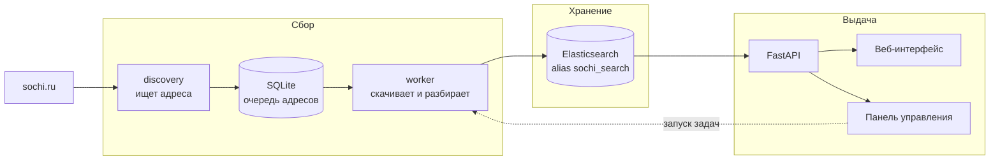
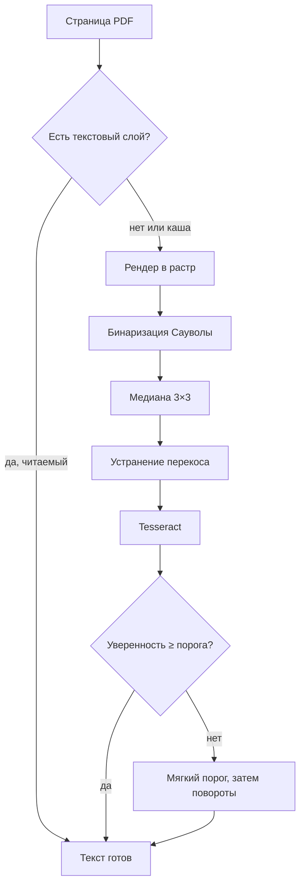

# Как устроен проект

Подробный разбор для того, кто будет с этим работать: что из чего
состоит, куда течёт текст, где принимаются решения и почему они приняты
именно такие.

README отвечает на вопрос «зачем и что получилось». Этот файл — на
вопрос «как это сделано и где что лежит».

---

## Содержание

1. [Общая картина](#общая-картина)
2. [Очередь: источник истины](#очередь-источник-истины)
3. [Обход сайта](#обход-сайта)
4. [Извлечение текста](#извлечение-текста)
5. [Распознавание сканов](#распознавание-сканов)
6. [Индекс Elasticsearch](#индекс-elasticsearch)
7. [Поиск](#поиск)
8. [API и интерфейс](#api-и-интерфейс)
9. [Панель управления](#панель-управления)
10. [Эксплуатация](#эксплуатация)
11. [Тесты и замеры](#тесты-и-замеры)
12. [Карта файлов](#карта-файлов)

---

## Общая картина

Система состоит из трёх слоёв, и они связаны только через данные, а не
через вызовы друг друга.



Слои разделены намеренно. Обход можно остановить, а поиск продолжит
работать. Индекс можно пересобрать, а очередь останется. Панель
управления запускает те же самые команды, что и расписание, и берёт те
же файлы блокировок — двух одновременных обходов не случится.

**Что где живёт:**

| Слой | Где | Чем управляется |
| --- | --- | --- |
| Очередь адресов | SQLite, `data/crawl_state.sqlite3` | `crawler_v2` |
| Текст документов | Elasticsearch, alias `sochi_search` | `crawler_v2/es_writer.py` |
| Настройки | `.env`, `.env.crawler` | в git не попадают |
| Языковые модели | `ocr/tessdata/` | в git есть |

---

## Очередь: источник истины

Всё, что система знает о сайте, лежит в одной таблице `crawl_urls`.

У каждого адреса есть состояние, хеш содержимого, число попыток и
аренда. Аренда — ключевая вещь: воркер помечает адрес своим
идентификатором и временем, и если процесс умрёт, адрес вернётся в
очередь сам, без ручного вмешательства. Поэтому обход можно
останавливать и продолжать когда угодно.

**Состояния адреса:**

| Состояние | Что означает | Вернётся в работу |
| --- | --- | --- |
| `discovered` | найден, ещё не обработан | сразу |
| `indexed` | текст в индексе | через `CRAWL_RECHECK_HOURS` |
| `retry` | временная ошибка | через `CRAWL_RETRY_HOURS` |
| `gone` | сервер отдаёт 404 | нет |
| `skipped_empty` | текста не нашлось | по расписанию |
| `skipped_unsupported` | формат не поддержан | нет |
| `skipped_corrupt` | файл битый | нет |
| `skipped_too_large` | больше предела загрузки | нет |

Три последних терминальны: повторять их бессмысленно, файл не изменится.

> Именно на `skipped_too_large` система однажды встала целиком. Статус
> ставил обходчик, показывала панель, а `mark_skipped` в базе его не
> принимала — падала с `ValueError`. Очередь разбирается по порядку,
> поэтому воркер падал на одном и том же PDF в 237 МБ каждый запуск.
> Функция была написана в трёх файлах, и ровно в одном её забыли.

Повторный проход не перекачивает то, что не изменилось: сравнивается
`ETag`, `Last-Modified` и хеш содержимого.

---

## Обход сайта

**`crawler_v2/discovery_worker.py`** ищет новые адреса: карта сайта,
ссылки со страниц, разделы с постраничной навигацией. Найденное кладётся
в очередь со статусом `discovered`.

**`crawler_v2/url_policy.py`** решает, что брать. Чужие хосты, якоря,
параметры сортировки и печатные версии отсеиваются здесь — иначе очередь
забивается дублями одной и той же страницы.

**`crawler_v2/fetcher.py`** качает. Здесь же пределы размера: обычный
документ до `CRAWL_MAX_DOWNLOAD_BYTES`, PDF до
`CRAWL_PDF_MAX_DOWNLOAD_BYTES`. Превышение — не ошибка, а решение не
качать: документ остаётся находимым по карточке родительской страницы,
где есть его название и реквизиты.

Большие PDF скачиваются во временный файл, а не в память: файл на 150 МБ
в оперативной памяти на машине с 8 ГБ, где живёт ещё и Elasticsearch, —
это отказ.

---

## Извлечение текста

**`crawler_v2/content_processing.py`** — самый крупный модуль, по одной
функции на формат.

| Формат | Функция | Чем читается |
| --- | --- | --- |
| HTML | `extract_html` | BeautifulSoup |
| PDF | `extract_pdf` | PyMuPDF, при нужде Tesseract |
| DOCX | `extract_docx` | python-docx |
| XLSX | `extract_xlsx` | openpyxl |
| RTF | `extract_rtf` | свой разбор управляющих слов |
| ODT, ODS | `extract_opendocument` | zipfile + ElementTree |
| TXT, CSV | `extract_text_document` | декодирование utf-8/cp1251 |

Из HTML выбрасывается обвязка: меню, хлебные крошки, подвал, формы,
кнопки «поделиться». Без этого каждая страница несёт одинаковые двести
слов навигации, и поиск по ним находит вообще всё.

### Реквизиты документа

Из текста вытаскиваются вид акта, номер и дата —
`crawler_v2/legal_metadata.py`. Это то, по чему документ ищут: «дай
постановление 512-р» встречается чаще, чем поиск по содержанию.

Источники, в порядке доверия:

1. **Родительская HTML-карточка.** Структурированная разметка сайта
   надёжнее, чем разбор текста, особенно у сканов.
2. **Текст самого документа.** Первая страница, шапка акта.
3. **Имя файла**, если оно осмысленное.

> Реквизиты долго извлекались только из PDF:
> `extract_legal_title_metadata` вызывался ровно в одном месте — внутри
> разбора PDF. Офисные файлы получали их исключительно по наследству от
> карточки, а найденные прямо в `/upload/` — не получали вовсе. В выдаче
> это выглядело как столбец из `028e97063df6b807dc50e5901603af2e.docx`
> без даты и номера. Теперь разбор общий: `describe_document` вызывается
> из всех форматов, текст есть текст.

### Заголовок

Битрикс раскладывает вложения по `/upload/iblock/` под хешами:
`028e97063df6b807dc50e5901603af2e.docx`,
`tg7dcgl1954sjipys673nrc12y1zd6o0.docx`. Показывать такое как название
нельзя — в выдаче получается столбец неразличимых строк.

`text_repair.technical_filename` отличает машинное имя от осмысленного:
длинная сплошная строка из букв и цифр без разделителей. Настоящее имя
отличается разделителями, кириллицей или длиной. Проверка стоит и у
обходчика, и на стороне выдачи — в индексе лежат записи, собранные до её
появления, и переобход корпуса ради заголовков никто затевать не станет.

### Нарезка на фрагменты

Текст режется на куски по `CRAWL_CHUNK_SIZE` (3500 знаков) с
перекрытием `CRAWL_CHUNK_OVERLAP` (350). Перекрытие нужно, чтобы фраза
на границе не пропала.

Каждый фрагмент — отдельный документ в Elasticsearch. В выдаче они
схлопываются по `url`, поэтому одна страница не занимает собой всю
первую страницу результатов.

---

## Распознавание сканов

Большая часть PDF на `sochi.ru` — фотографии бумаги без текстового слоя.
Для поиска такой файл пустой.

### Порядок



**`crawler_v2/pdf_ocr.py`** решает, нужно ли распознавать:
`evaluate_text_quality` отличает осмысленный текст от глифовой каши по
письменности, обычным словам, регистру и мусорным знакам.

**`crawler_v2/pdf_ocr_image.py`** готовит изображение:

- **бинаризация Сауволы** — порог считается по окну вокруг каждого
  пикселя. Глобальный порог Оцу на выцветшей ксерокопии даёт либо чёрное
  пятно, либо белый лист;
- **медиана 3×3** — убирает точки тонера. Без неё двенадцать из
  восемнадцати сочетаний параметров дают **ровно ноль символов**: анализ
  раскладки принимает точки за элементы вёрстки;
- **устранение перекоса** — угол оценивается по резкости профиля
  проекции. Бинаризация делается **до** оценки угла, иначе тень от края
  листа перевешивает текст.

**`crawler_v2/pdf_ocr_engine.py`** вызывает Tesseract и решает, повторять
ли.

### Уверенность как признак

Оценка качества текста отличает осмысленный текст от каши, но не
отличает верно распознанную страницу от неверно распознанной:

| Страница | Точность | Уверенность Tesseract | Балл оценки |
| --- | ---: | ---: | ---: |
| Современный скан | 99,4 % | 95,8 | 100 |
| Архивная копия | 98,4 % | 90,2 | 100 |
| Выцветшая копия | 49,7 % | **23,7** | **100** |

Страница, распознанная на 50 %, — это осмысленный русский текст, просто
неправильный. Уверенность её отличает, и достаётся она бесплатно: тот же
запуск, второй вид выдачи.

> Виды выдачи задаются переменными `-c tessedit_create_txt=1` и
> `tessedit_create_tsv=1`, а не именами файлов конфигурации. Имена `txt`
> и `tsv` Tesseract ищет в `$TESSDATA_PREFIX/configs/`, которого в
> `ocr/tessdata` нет. На сервере это давало нулевую уверенность, лестница
> повторов шла на каждой странице, и время выросло в двадцать раз.

### Лестница повторов

Запускается только при низкой уверенности. Порядок: мягкая бинаризация,
затем повороты 90°, 270°, 180°. Останавливается на первой попытке,
прошедшей порог.

| Страница | Одна попытка | С повторами |
| --- | ---: | ---: |
| Современный скан | 98,9 % | 98,9 % |
| Архивная ксерокопия | 98,0 % | 98,0 % |
| Выцветшая копия | 47,3 % | **55,5 %** |
| Повёрнутая на 90° | 16,9 % | **98,3 %** |

Повёрнутый лист — не экзотика: альбомный скан А4 попадает в архив так же,
как книжный, и раньше терялся целиком.

### Починка текста

**`crawler_v2/text_repair.py`** чинит то, что ломает именно поиск:

- **переносы по слогам.** «благоустрой-\nство» — два токена, ни один не
  найдётся по «благоустройство». На постановлении в тридцать строк таких
  разрывов пять-семь, и все на содержательных словах;
- **латинские двойники кириллицы.** «Сочи» с латинской C — для поиска
  другое слово. Настоящее слово не смешивает письменности, поэтому
  смешанный токен чинится однозначно;
- **номера актов.** «512-p» с латинской «p» — другой номер.

Нормализация NFC, а не NFKC: NFKC переписал бы «№» в «No», а знак номера
стоит в шапке каждого акта и виден пользователю.

### Охват вместо глубины

Первый проход читает `CRAWL_PDF_OCR_COVERAGE_PAGES` (2) страницы каждого
скана. Заголовок, номер и дата — всё, по чему документ ищут, — лежат на
первых страницах. Так весь корпус становится находимым за часы, а не за
недели. Остальное дочитывается фоном.

Считаются **попытки распознавания, а не номера страниц**. Ограничение по
номеру ведёт себя иначе на смешанном документе: у акта с текстовым слоем
на первых листах и сканированным приложением с третьего распознавать в
окне нечего, а всё нуждающееся в OCR лежит за его границей.

---

## Индекс Elasticsearch

Схема — `elasticsearch/sochi_docs_v4.json`. Индекс адресуется через alias
`sochi_search`, поэтому его можно пересобрать и переключить без простоя.

### Анализаторы

| Имя | Для чего |
| --- | --- |
| `russian_text` | основной: стеммер, стоп-слова, `ё → е` |
| `russian_exact` | без стемминга: точная словоформа выше приблизительной |
| `document_number_index` | номера актов, индексная сторона |
| `document_number_text` | номера актов, сторона запроса |

`ё` сводится к `е` на уровне char_filter, поэтому «ёлка» и «елка» — одно
и то же.

### Номера актов

Самое хитрое место. Один акт встречается как «512-р», «№ 512-р»,
«512 – Р», «512-p» с латинской «p».

`word_delimiter_graph` с `catenate_all` разбивает «512-р» на «512», «р» и
слитный «512р», чтобы номер находился в любом написании. На индексной
стороне после него обязателен `flatten_graph`: обратный индекс не хранит
длину токена в позициях, и без выпрямления поток пишется со сдвигом.

> Нормализация номера долго делалась дважды: в Python при построении
> запроса и нормализатором в схеме — по-разному. «№ 512-р» лежал в
> индексе как «№  512-р», а искался как «512-р». Из семи реалистичных
> написаний точное совпадение срабатывало на двух. Теперь функция одна,
> а тест воспроизводит правила `mapping`-фильтра и сверяет их с ней.

### Поля

Тридцать пять полей. Значимые:

| Поле | Что в нём |
| --- | --- |
| `url` | адрес; по нему схлопывается выдача |
| `text` | фрагмент текста, подполе `.exact` без стемминга |
| `title`, `attachment_title` | заголовок страницы и название вложения |
| `document_number` | номер как в источнике |
| `document_number_normalized` | канонический вид для точного совпадения |
| `document_kind`, `document_date` | вид акта и его дата |
| `sort_date` | единая дата сортировки |
| `content_category` | рубрика, вычисляется при индексации |
| `ocr_used`, `ocr_confidence` | распознавалась ли страница и насколько уверенно |

`dynamic: strict` — новое поле в записи обходчика не создаётся молча, а
вызывает явную ошибку.

**Одна дата сортировки.** Раньше фильтр перебирал `document_date`,
`published_at` и `sort_date` через `should`, и акт 2019 года с датой
публикации 2024 находился по обоим годам.

---

## Поиск

**`app_v2/search_query.py`** собирает запрос, **`search_service.py`**
приводит ответ к виду, удобному интерфейсу.

### Строение запроса

Одна обязательная часть определяет попадание, набор `should` только
повышает уже найденное. Раньше было одиннадцать пересекающихся веток
`should`, их баллы складывались, и документ, случайно совпавший в
нескольких полях, обгонял точное совпадение.

```
must:   multi_match cross_fields по title, attachment_title, text,
        section, document_kind.text
        minimum_should_match: "3<75%"

should: точная фраза по title.exact      (вес 12)
        точная фраза по attachment_title.exact (вес 10)
        точная фраза по text.exact       (вес 6)
        фраза по леммам text, slop 3     (вес 3)
        все слова в title                (вес 4)
        номер акта, если запрос на него похож (вес 40)
```

**`3<75%`** читается так: до трёх слов нужны все, свыше — три четверти.
Просто `75%` округляется вниз и на коротком запросе вырождается: у
«постановление о благоустройстве» после удаления стоп-слова остаётся два
слова, 75 % от двух — одно, и хватало совпадения по «постановление».

| Запрос | Было | Стало |
| --- | ---: | ---: |
| `512-р` | 2460 | **4** |
| `постановление о благоустройстве` | 10277 | **387** |

### Синтаксис запроса

- **кавычки** — точная фраза: `«состав семьи»`. Проверяется и по точной
  словоформе, и по лемме: только `.exact` отсекала бы «о благоустройстве
  территории» при запросе «благоустройство территории», только лемма —
  стирала бы разницу, ради которой кавычки и ставят;
- **минус перед словом** — исключение: `благоустройство -конкурс`.
  Распознаётся только после пробела, поэтому «512-р» и «город-курорт»
  остаются целыми.

Полноценный синтаксис с `AND`, `OR` и скобками сознательно не сделан: его
нужно объяснять, а `query_string` с пользовательским вводом падает на
несбалансированной скобке.

### Схлопывание и фасеты

Выдача схлопывается по `url`: одна страница даёт один результат, а не
десять фрагментов. Число документов считается агрегацией `cardinality`.

Рубрика применяется как `post_filter`, а не обычный фильтр: обычный сузил
бы и агрегации, и счётчики остальных вкладок обнулились бы.

### Опечатки

Если точный поиск не дал ничего, выполняется нечёткий — по меньшему
набору полей, с `fuzziness: AUTO`. Только при нулевом результате: иначе
он смещал бы обычную релевантность.

---

## API и интерфейс

**`app_v2/main.py`** — FastAPI.

| Точка | Что делает |
| --- | --- |
| `GET /search` | поиск, JSON |
| `GET /answer` | сводка по верхним результатам |
| `GET /stats` | размер индекса и корпуса |
| `GET /pipeline/status` | состояние очереди и распознавания |
| `GET /health/live` | процесс жив |
| `GET /health/ready` | Elasticsearch отвечает |
| `GET /ui` | интерфейс поиска |
| `GET /admin` | панель управления |

`GET /search?q=…` отдаёт готовый JSON, поэтому бот в мессенджере
встаёт соседним контейнером в ту же сеть и ходит на `http://api:8000`.

Интерфейс — обычный JavaScript без фреймворков и сборки. Для служебной
системы на десяток-другой сотрудников это осознанный выбор: нечему
протухать, нечего пересобирать, поддержит любой, кто знает JavaScript.

---

## Панель управления

**`app_v2/admin.py`**, **`admin_tasks.py`**, **`admin_auth.py`**.

Показывает состояние кластера, размер индекса, разбивку очереди по
состояниям и форматам, прогресс распознавания, состояние служб systemd.

Пять задач запускаются кнопками с живым журналом: `discovery`, `worker`,
`pdf_ocr`, `publication_date`, `reindex_url`.

Панель намеренно **не управляет службами** — для этого нужен root.
Задачи запускаются напрямую и берут те же файлы блокировок, что и
расписание.

Вход: логин, пароль, сессия на 12 часов. Пароль хранится хешем SHA-256,
смена пароля завершает все открытые сеансы. Сам поиск открыт всем.

---

## Эксплуатация

### Процессы

| Служба | Что делает | Ритм |
| --- | --- | --- |
| `sochi-search-api-v2` | поиск и панель | постоянно |
| `sochi-search-discovery` | ищет новые адреса | раз в час |
| `sochi-search-worker` | разбирает очередь | раз в 2 минуты |
| `sochi-search-pdf-ocr@1/@2` | распознают сканы | непрерывно, два слота |
| `sochi-search-publication-date` | восстанавливает даты | раз в 5 минут |
| `sochi-search-backup` | резервная копия | ежедневно |

Два слота OCR, а не один процесс в два потока. Замер: два потока
ускоряют отдельную страницу на 29 %, но по пропускной способности
проигрывают — 0,165 против 0,233 страниц в секунду. `OMP_THREAD_LIMIT=1`,
параллелизм задаётся числом слотов.

### Настройки

Два файла, оба вне git:

- **`.env`** — API, панель, Elasticsearch;
- **`.env.crawler`** — обход и распознавание. Воркер читает **его**, а не
  `.env`: значение оттуда перекроет значение по умолчанию из кода.

Шаблон — `.env.production.example`.

### Перенос индекса

`ops/reindex.py` — схема задаётся ключом `--mapping`, поэтому модуль не
привязан к её номеру.

```bash
python -m ops.validate_elasticsearch --mapping elasticsearch/sochi_docs_v4.json
python -m ops.reindex --create --reindex --verify
python -m ops.reindex --switch
python -m ops.reindex --rollback --previous <прежний индекс>
```

Alias переключается одной атомарной операцией. Прежний индекс не
удаляется.

Отдельный шаг `--finalize` возвращает обновление индекса и сливает
сегменты: на время заливки обновление отключено, и прерванный перенос
оставляет индекс нечитаемым, хотя данные в нём есть.

### Резервные копии

`ops/backup.py` кладёт SQLite и настройки в архив, `ops/verify_backup.py`
проверяет, что архив читается и база цела.

Индекс Elasticsearch в копию не входит: он восстанавливается из очереди
повторным обходом, а весит втрое больше.

---

## Тесты и замеры

```bash
python -m unittest discover -s tests -p "test_*.py"
```

316 тестов, пять пропускаются: они описывают снятый движок распознавания
и оставлены как описание прежнего поведения.

Тесты идут не только по единицам кода, но и по **классам ошибок, которые
однажды прошли мимо**:

| Файл | Что стережёт |
| --- | --- |
| `test_wiring.py` | модуль написан и не подключён; пакет вне списка проверяемых; печатаемая команда указывает на несуществующий модуль; версия разъехалась по шести файлам; тесты не запускаются на Python 3.8 |
| `test_document_number.py` | нормализация номера в схеме и в запросе разошлась |
| `test_skip_statuses.py` | обходчик ставит статус, которого база не принимает |
| `test_document_titles.py` | машинное имя файла показывается как заголовок |
| `test_ocr_engine.py` | вызов Tesseract зависит от содержимого `configs/` |

Качество распознавания тестами не проверяется — оно измеряется:

```bash
python -m ops.ocr_benchmark
```

Страницы синтезируются из известного текста и портятся так, как их портит
копирование и сканирование. Эталон известен побайтово, поэтому считаются
CER и WER. Подробности — `docs/OCR_BENCHMARK.md`.

---

## Карта файлов

### `app_v2` — поиск

| Файл | Строк | Что делает |
| --- | ---: | --- |
| `main.py` | 614 | FastAPI, точки входа |
| `search_query.py` | 759 | сборка запроса, кавычки, минус-слова, номера |
| `search_service.py` | 1572 | разбор ответа, заголовки, фрагменты |
| `pipeline_status.py` | 522 | состояние очереди для панели |
| `admin.py` | 507 | панель управления |
| `admin_tasks.py` | 428 | запуск задач с журналом |
| `admin_auth.py` | 154 | вход, сессии |
| `es_http.py` | 168 | клиент Elasticsearch |
| `static/` | ~4800 | интерфейс без сборки |

### `crawler_v2` — сбор и разбор

| Файл | Строк | Что делает |
| --- | ---: | --- |
| `content_processing.py` | 2733 | извлечение текста из всех форматов |
| `incremental_worker.py` | 1915 | разбор очереди, запись в индекс |
| `publication_date_worker.py` | 1318 | восстановление дат публикации |
| `pdf_ocr.py` | 1011 | оценка качества текста, решение о распознавании |
| `incremental_db.py` | 918 | очередь: состояния, аренда |
| `discovery_worker.py` | 888 | обход сайта |
| `pdf_ocr_engine.py` | 728 | вызов Tesseract, уверенность, повторы |
| `legal_metadata.py` | 650 | вид акта, номер, дата |
| `config.py` | 591 | настройки из окружения |
| `fetcher.py` | 496 | загрузка с пределами размера |
| `text_repair.py` | 362 | переносы, двойники, номера, имена файлов |
| `es_writer.py` | 336 | запись в Elasticsearch |
| `pdf_ocr_image.py` | 309 | Саувола, медиана, перекос |

### `ops` — эксплуатация

| Файл | Строк | Что делает |
| --- | ---: | --- |
| `ocr_benchmark.py` | 880 | замер распознавания с эталоном |
| `reindex.py` | 705 | перенос индекса, alias, откат |
| `backup.py` | 530 | резервные копии |
| `validate_elasticsearch.py` | 509 | проверка схемы на живом кластере |
| `verify_backup.py` | 355 | проверка целостности копии |
| `wait_for_elasticsearch.py` | 214 | ожидание готовности кластера |

### Прочее

```
elasticsearch/sochi_docs_v4.json   схема индекса и анализаторы
ocr/tessdata/                      языковые модели Tesseract
systemd/                           юниты и drop-in для установки без Docker
docker/entrypoint.sh               одна роль на контейнер
tests/                             316 тестов на стандартном unittest
docs/                              развёртывание, замеры, переход на v4
```

---

## Что стоит знать, прежде чем менять

**Версия распознавания.** `PDF_EXTRACTION_VERSION` в
`crawler_v2/pdf_ocr.py` поднимается при любом изменении, влияющем на
результат. По ней фоновый проход отбирает документы на перечитывание —
подняли строку, и корпус читается заново.

**Схема индекса строгая.** Новое поле в записи обходчика без правки
`sochi_docs_v4.json` вызовет ошибку `bulk`, а не тихое создание поля.

**Настройки читаются из двух файлов.** Значение в `.env.crawler`
перекрывает значение по умолчанию из кода, и об этом легко забыть.

**Одна нормализация на весь проект.** Если номер акта, имя файла или
текст нужно привести к каноническому виду — функция уже есть в
`text_repair.py`. Вторая реализация того же правила рано или поздно
разойдётся с первой; в этом проекте так уже случалось трижды.
